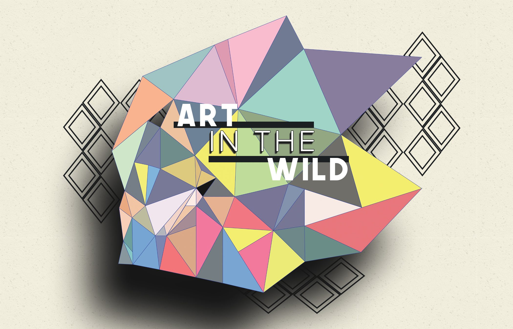

### Where Art Meets Adventure

### Built by: **[Matthew Gonczar](https://www.linkedin.com/in/matthew-gonczar/)**

**_Download Art in the Wild Native from the Google Play Store (iOS version coming soon)._** 

## [Art in the Wild](https://play.google.com/store/apps/details?id=com.gonzatron.artinthewild&hl=en-US&ah=sX60FAN83L6q7EXIiSU9q4z1MEk)

### Description:

Welcome to Art in the Wild Native, a captivating front-end application built using React Native with Expo. Born from the success of the original web-based Art in the Wild, this native app is designed to bring the thrill of discovering public art right to your mobile device. Explore the beauty of the world's public art installations with ease and convenience, available now on the Google Play Store, with plans to launch on the Apple App Store soon.

Note: This app is currently under development, and new features are continuously being added. Stay tuned for updates and enhancements as we strive to create the ultimate art discovery experience on mobile.

### Features:

- Effortless Art Discovery: Seamlessly search for captivating public art pieces using the built-in search functionality. You can search by title, artist, or even zip code to find art closest to your location.

- Interactive Art Map: Experience the thrill of exploring art through an intuitive map generated by Google Maps API. Art locations are marked with precision, guiding you on an unforgettable journey.

- User Registration and Authentication: Create your personal account to unlock exclusive features. Art in the Wild ensures your data's security with JWT-based session management.

- Contribute to the Art Community: Share your art discoveries with the world by uploading new art pieces you find. Capture moments of beauty by uploading pictures of art installations, leveraging Amazon S3 storage for efficient handling.

 <h2>:camera_flash: Visuals and Helpful Insight: </h2>

Coming soon...
